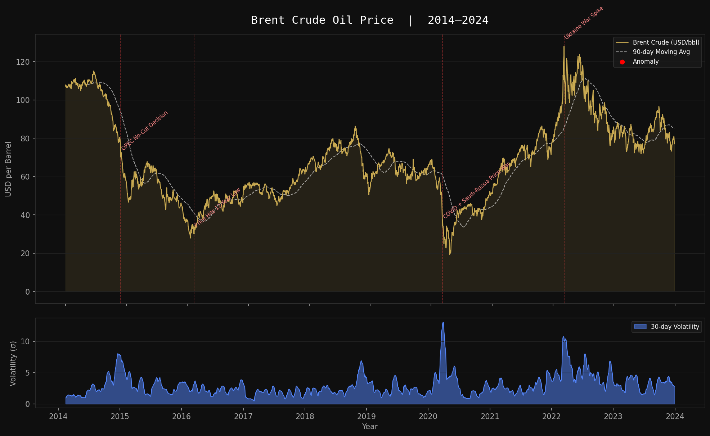

# Oil Price Time Series Dashboard

A Python data pipeline that downloads, cleans, and visualizes 10 years of Brent Crude oil prices (2014–2024).

## What it does
- Downloads real Brent Crude price data via `yfinance`
- Validates data integrity and flags statistical anomalies (3σ threshold)
- Annotates major global events (COVID, Ukraine war, OPEC decisions)
- Plots price trends, 90-day moving average, and 30-day volatility

## Output


## Tech Stack
Python, pandas, matplotlib, yfinance

## Setup
```bash
python -m venv venv
source venv/bin/activate
pip install yfinance pandas matplotlib
python pipeline.py
```
